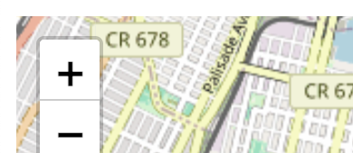
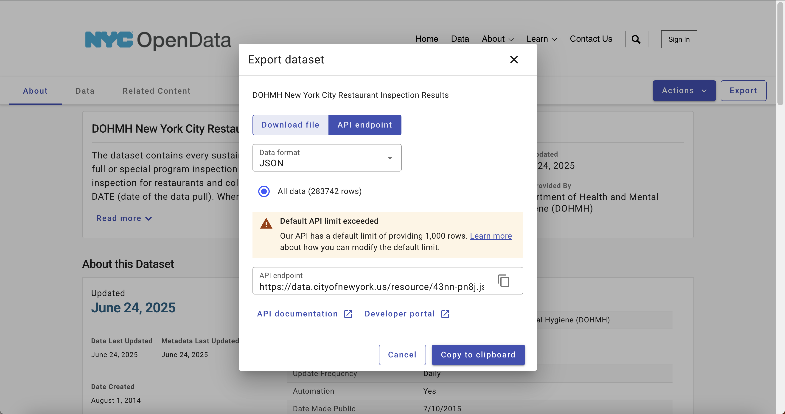
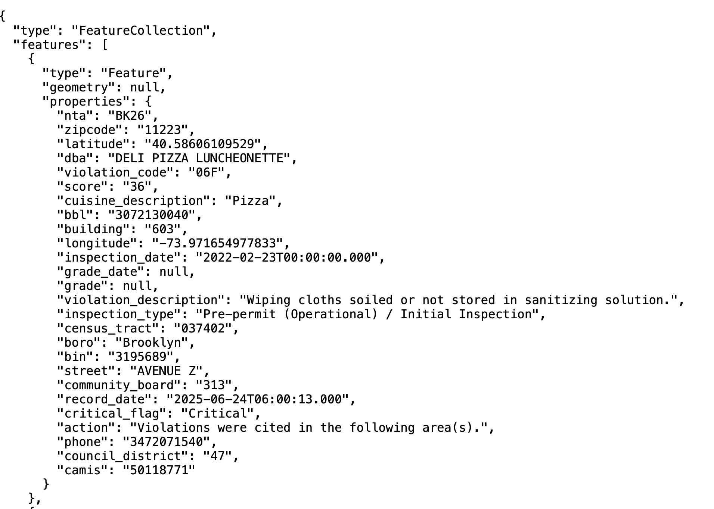

# 03. Making a web map

To this point, we have been working with data in Python and (mostly) visualizing it in our Jupyter notebooks. Now we will take the next step and create a series of files that together comprise a web map that we will then publish. This exercise will be done in two parts. In this first part, we will create the files that will be used to display the map and a basic dataset on a web page. In the second part, we will serve more complex data to our site and publish the map to a web server.

Our map will consiste of three files, each of which performs a specific function:

1. An HTML file (`index.html`) that will display the map and the data. This file will contain the _structure_ of our web page, and will invoke the other two files.
2. A JavaScript file (`main.js`) that will contain the code to create the map and add the data to it. This file will contain the _logic_ of our web page.
3. A CSS file (`style.css`) that will contain the styles for our web page. This file will contain the _style_ of our web page.

## 1. Create the HTML file

We will start by creating the HTML file that will serve as the structure of our web page.
Create a new file called `index.html` in your project directory and add the following code to it:

```html
<!DOCTYPE html>
<html>
  <head>
    <title>A super cool website</title>
    <meta charset="utf-8" />
    <meta name="viewport" content="width=device-width, initial-scale=1.0" />
  </head>
  <body>
    <!-- we'll add content here later -->
  </body>
</html>
```

This code creates a basic HTML document with a title and the necessary meta tags for character encoding and responsive design. The `<body>` tag is currently empty, but we will add content to it later. We'll also add links to the JavaScript and CSS files that we will create in the next steps. The head is also where we can link to external libraries, which we will use to create our map.


The primary library we will use is: 
-`Leaflet`: Leaflet is a popular open-source JavaScript library for interactive maps. It provides an easy-to-use API for creating maps and adding layers, markers, and other features. We will use Leaflet to create our map and add data to it.

Per the [Leaflet documentation](https://leafletjs.com/download.html), we can include the library in our HTML file by adding the following lines to the `<head>` section:

```html
<!-- previous head content... -->
<link
  rel="stylesheet"
  href="https://unpkg.com/leaflet@1.9.4/dist/leaflet.css"
  integrity="sha256-p4NxAoJBhIIN+hmNHrzRCf9tD/miZyoHS5obTRR9BMY="
  crossorigin=""
/>
<script
  src="https://unpkg.com/leaflet@1.9.4/dist/leaflet.js"
  integrity="sha256-20nQCchB9co0qIjJZRGuk2/Z9VM+kNiyxNV1lvTlZBo="
  crossorigin=""
></script>
<!-- add before the closing </head> tag -->
```

The first item, the `<script>` tag, includes the Leaflet JavaScript library, and the second item, the `<link>` tag, includes the Leaflet CSS file. This will allow us to use Leaflet to create our map. Together, these two lines will allow us to use Leaflet to create our map.

Altogether, the `<head />` in your `index.html` file should look like this:

```html
<!DOCTYPE html>
<html>
  <head>
    <title>A super cool website</title>
    <meta charset="utf-8" />
    <meta name="viewport" content="width=device-width, initial-scale=1.0" />
    <link
      rel="stylesheet"
      href="https://unpkg.com/leaflet@1.9.4/dist/leaflet.css"
      integrity="sha256-p4NxAoJBhIIN+hmNHrzRCf9tD/miZyoHS5obTRR9BMY="
      crossorigin=""
    />
    <script
      src="https://unpkg.com/leaflet@1.9.4/dist/leaflet.js"
      integrity="sha256-20nQCchB9co0qIjJZRGuk2/Z9VM+kNiyxNV1lvTlZBo="
      crossorigin=""
    ></script>
  </head>
</html>
```

Note that you may need to adjust the version numbers in the URLs to match the latest version of Leaflet at the time you are working on this project. You can find the latest version on the [Leaflet download page](https://leafletjs.com/download.html).

Now that we have the basic structure of our HTML file, we can move on to the next step, which is to create the JavaScript file that will contain the code to create the map and add data to it.

## 2. Create the JavaScript file

Next, we will create the JavaScript file that will contain the code to create the map and add data to it. Create a new file called `main.js` in your project directory and add the following code to it:

```javascript
// Create a map and set its view to a specific location and zoom level
var map = L.map("map").setView([40.70491, -73.97144], 13);

// Add a tile layer to the map (this is the base layer that provides the map imagery)
L.tileLayer("https://{s}.tile.openstreetmap.org/{z}/{x}/{y}.png", {
  maxZoom: 19,
  attribution: "© OpenStreetMap contributors",
}).addTo(map);
```

Let's break down what this code does:

- The first line creates a map object using the `L.map` function from the Leaflet library, and sets the origin of the map (in the square brackets) to a specific latitude and longitude, as well as the zoom level (in this case, 13). The `map` identifier refers to the HTML element that will contain the map, which we will create in the next step.
- The second line adds a tile layer to the map using the `L.tileLayer` function. This layer provides the base map imagery, which in this case is sourced from OpenStreetMap. We will return to this later to add more layers to our map. As you can see, we are instructing that this be added to our map (`addTo(map)`).

Return to your `index.html` file and add a `<div>` element inside the `<body>` tag to serve as the container for the map. This is where the map will be displayed. We will also invoke the `main.js` file at the end of our `body` section. Add the following code inside the `<body>` tag:

```html
<body>
  <div id="map" style="height: 100vh;"></div>
  <script src="main.js"></script>
</body>
```

For now, we are setting the height of the map to `100vh`, which translates to 100 view height units (i.e. take up the entire view height) but you can adjust this value as needed. The `id` attribute of the `<div>` element is set to `map`, which matches the identifier we used in the JavaScript code to create the map. Later we will pull this out into a separate CSS file to style it further.

Ok, now let's take a look at what we have so far. To view your web map, make sure you have installed the [Live Server extension in VS Code](https://marketplace.visualstudio.com/items?itemName=ritwickdey.LiveServer) and then right-click on the `index.html` file and select "Open with Live Server". This will start a local web server and open your web map in a new browser tab.

You should see the following map displayed in your browser:


You should be able to pan and zoom the map. Although this is a very basic example, we are leveraging some important web technologies to create an interactive map, namely, we are requesting map tiles from a remote server (OpenStreetMap) and displaying them in our web browser using JavaScript (in <30 total lines of code no less!).

## 3. Create the CSS file

Finally, we will create a CSS file to style our web page. There is a whole wide world of styling available to us, but for now we'll just clean up a few minor items to get started. You may have noticed that there is a bit of white space around the map in the browser. This is because the default margin and padding for the `<body>` element is set to 8px in most browsers. We can remove this by adding some CSS to our page.




It's a minor detail, but it can be distracting when working with maps. We can also set the font family for the page to something more modern and readable. We'll also refactor the `map` element to not have in-line styles, but rather to use the `id` identifier `#` to refer to it in our css file. Note that `body` doesn't need any identifier, as it is a global element that applies to the entire page. (CSS `classes` use the `.` identifier, for example, but we will not be using those yet).

Create a new file called `style.css` in your project directory and add the following code to it:

```css
body {
  margin: 0;
  padding: 0;
  font-family: Arial, sans-serif;
}

#map {
  width: 100%;
  height: 100vh;
}
```

## 4. Adding data to the map

Now that we have the basic structure of our web page and the map, we can add some data. In the next part of this tutorial, we will consider adding data from different source types, but for now we will add data from the New York City's Open Data portal API. We will load restaurant data and display it on the map as a point layer.

Navigate to the [DOHMH Restaurant Inspection Results dataset](https://data.cityofnewyork.us/Health/DOHMH-New-York-City-Restaurant-Inspection-Results/43nn-pn8j/about_data) on the NYC Open Data portal. This dataset contains information about restaurant inspections in New York City, including the name of the restaurant, its address, and the inspection results.

We can see on the open data portal's website that each dataset has an `Actions` dropdown, and within that there's an `API` option:




The API endpoint given there is how we will programmatically access the data; instead of downloading and then serving the data from our website, we will simply make a request to this service and load from there.

However, we'll need to both filter the data to not exceed the maximum number of records returned (which is 1000) and to transform the data into a format that Leaflet can understand. We will use the `geojson` format, which is a common format for representing geographic data.

To do this, we will use the `fetch` API in JavaScript to make a request to the API endpoint and then process the data. We will add this code to our `main.js` file.

Add the following code to your `main.js` file, after the code that creates the map:

```javascript
// Fetch pizza restaurant data from the NYC Open Data API
fetch(
  "https://data.cityofnewyork.us/resource/43nn-pn8j.geojson?cuisine_description=Pizza&$limit=10000"
)
  .then((response) => response.json())
  .then((data) => {
    // do something with the data
  })
  .catch((error) => console.error("Error fetching data:", error));
```

This code uses the `fetch` API to make a request to the NYC Open Data API endpoint for pizza restaurants. The `cuisine_description=Pizza` query parameter filters the data to only include pizza restaurants, and the `$limit=10000` parameter increases the maximum number of records returned to 10,000. We will then chain a series of `.then()` methods to process the data once it is returned. This is a common pattern in JavaScript for handling asynchronous operations like fetching data from an API. The first `.then()` method converts the response to JSON format, and the second `.then()` method will be used to process the data. The `.catch()` method will log any errors that occur during the fetch operation.

Next we'll reshape the raw `JSON` that's returned into a format that Leaflet can understand. Copy and paste query above into your browser. You should see something like the following:





There's a lot of information here, including a `latitude` and `longitude` for each restaurant, but mapping libraries expect a specially-formatted `geometry` field. We can use an iterator to loop through the `features` array in the JSON response and create a new array of objects that contains the `geometry` and `properties` fields that Leaflet expects.

Add the following code to your `main.js` file, inside the second `.then()` method:

```javascript
data.features.forEach((feature) => {
  feature.geometry = {
    type: "Point",
    coordinates: [
      Number(feature.properties.longitude),
      Number(feature.properties.latitude),
    ],
  };
});
```

What we're doing is requesting _for each_ feature, to return a new `geometry` object that contains the `type` (which is always `Point` for our purposes) and the `coordinates`, which we are converting to numbers from strings. This will allow Leaflet to understand the data and display it on the map. However, this doesn't actually add the data to the map yet. We still need to create a layer and add it to the map.

Within the same second `then(...)` method, we need to add some additional code below the `forEach` loop to create a layer and add it to the map. We'll now operationalize the `L.geoJSON` function to create a new GeoJSON layer and add it to the map. This function takes the processed data and creates a layer that Leaflet can display. If we pass the `data` object to `L.geoJSON`, it will create a marker layer instead of a point layer:

```javascript
    L.geoJSON(data).addTo(map);
```


## 5. Styling the markers
This is fine, but not super legible. We want to convert this marker layer to a point layer, which will allow us to customize the appearance of the markers. We can do this by using the `pointToLayer` option in the `L.geoJSON` function. Update the above code to include the following argument *after* the instantiation of the `L.geoJSON` function:

```javascript
    L.geoJSON(data, {
        pointToLayer: function (feature, latlng) {
            return L.circleMarker(latlng, {
                radius: 8,
                fillColor: "#ff7800",
                color: "#000",
                weight: 1,
                opacity: 1,
                fillOpacity: 0.8
            });
        }
    }).addTo(map);
```

We are able to pass an *object* as an additional argument. Leaflet has an option called `pointToLayer` that allows us to customize the appearance of the markers. In this case, we are creating a `circleMarker` with a radius of 8 pixels, a fill color of orange (`#ff7800`), a black border (`#000`), and an opacity of 0.8. This will give us a more visually appealing representation of the pizza restaurants on the map. You can imagine the range of possibilities that we could use here, including custom icons, colors, and sizes, as well as styling based on the data itself (e.g. different colors for different inspection results).

Our map should now look like this:


## 6. Add interactivity to the map

Finally, we can add some basic interactivity to the markers by adding a popup that displays the name of the restaurant when the marker is clicked. We can do this by using the `onEachFeature` option in the `L.geoJSON` function. Update the above code to include the following argument *after* the `pointToLayer` option:

```javascript
    onEachFeature: function (feature, layer) {
        layer.bindPopup(feature.properties.dba);
    }
```

This tells our map that for each feature in the GeoJSON data, we want to bind a popup to the layer that displays the `dba` (Doing Business As) name of the restaurant. This will allow users to click on a marker and see the name of the restaurant in a popup. Like before, you could imagine a range of possibilities here, including displaying more information about the restaurant, such as the address, inspection results, and so on. You can pass html strings to the `bindPopup` method to customize the content of the popup, including links, images, and other HTML elements.

You should now be able to click on a marker and see the name of the restaurant:


This concludes the first part of our web mapping tutorial. We have created a basic web map using Leaflet, added a tile layer, and displayed data from the NYC Open Data API as a point layer on the map. We have also added some basic interactivity to the markers by binding popups to them. In the next part of the tutorial, we will explore how to serve more complex data to our site via an API that we create, and publish the map to a web server. 
