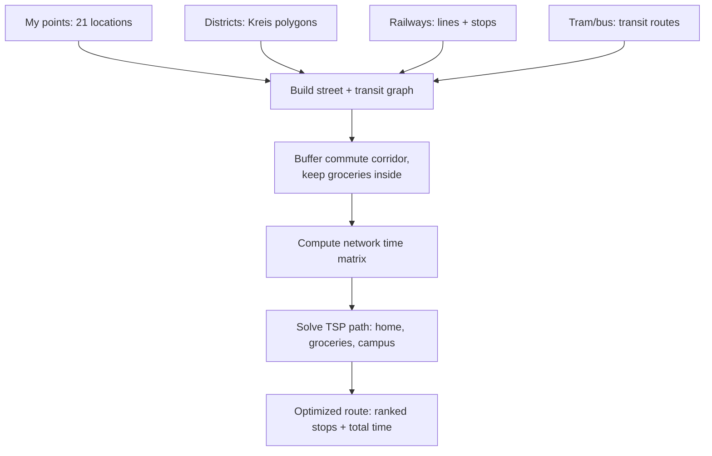
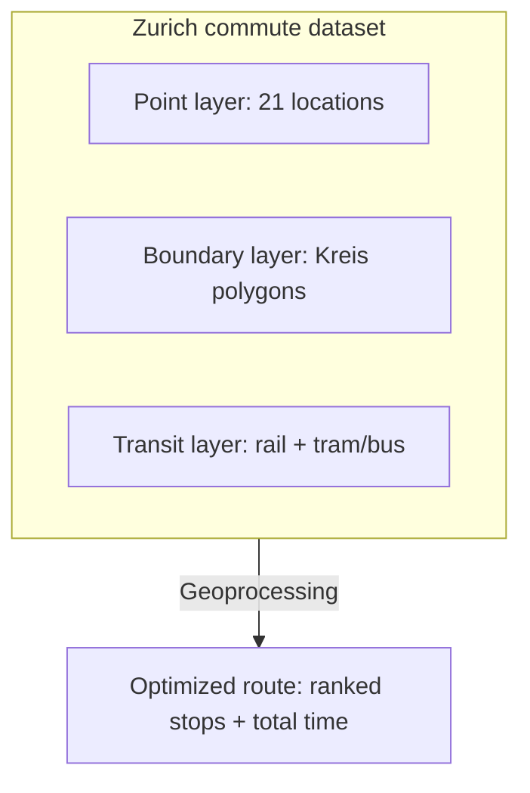

# Zurich Mental Map

## Narrative

For one year of my visiting study in Zuring, I lived in an apartment near **Zürich Altstetten**, and my major route was commuting between two ETH campuses — **ETH Zentrum** and **ETH Hönggerberg** — and a rotating set of **18 grocery stores** scattered across the neighborhoods I passed through on a near-daily basis. Rather than tracing my exact commute routes, this dataset captures the *destinations* that defined my daily geography: one home, two campuses, and the everyday errands in between. Together they sketch a lived version of "my neighborhood" that's wider and messier than any single official district.

## Data

- [`zurich-mental-map.csv`](./zurich-mental-map.csv)
- [`zurich-mental-map.geojson`](./zurich-mental-map.geojson)

Both files contain the same 21 point features:

| category | count | fields |
|---|---|---|
| `home` | 1 | id, name, lat/lon, marker_color, notes |
| `campus` | 2 | id, name, lat/lon, marker_color, notes |
| `grocery` | 18 | id, name (generic placeholder), lat/lon, marker_color |

## Project goal

Turn this personal-geography dataset into a small route-optimization
project: **which of my 18 grocery stops could realistically be folded into
my daily commute, and in what order, to minimize total travel time?** This
reframes the assignment's "relate this dataset to another" prompt as a
concrete geoprocessing + optimization pipeline rather than a one-off
spatial join.

**Question:** given my home and two campuses as fixed points, which
grocery stores fall within a reasonable walking/transit corridor of my
commute, and what's the time-optimal order to visit a subset of them
without a large detour — essentially an open-path travelling salesman
problem (TSP) constrained by the real street and transit network, not
straight-line distance.

## Available datasets

| Dataset | Geometry | Source | Role |
|---|---|---|---|
| My mental map | Point | This project | Origins/destinations (home, campuses, grocery candidates) |
| Kreis (district) boundaries | Polygon | Stadt Zurich | Context — which districts my points/route pass through |
| Railway network + metadata | Line | Provided GeoJSON | Transit edges for the network graph |
| Tram/bus network | Line (shapefile) | Provided SHP | Transit edges for the network graph |

## Method diagram

**Step-by-step:**

1. **Build a multimodal network graph** combining walkable streets with the railway and tram/bus lines, so travel time reflects real transit options rather than straight-line distance.

2. **Buffer my two commute paths** (home to ETH Zentrum, home to ETH Hoenggerberg) by a walking-distance threshold (e.g. 300-400m) to define a "within-reach" corridor, then **intersect** with the 18 grocery points to keep only the candidates realistically on the way.

3. **Compute a network distance/time matrix** between home, both campuses, and the filtered grocery candidates -- using graph shortest-path, not Euclidean distance.

4. **Solve an open-path TSP** (start = home, end = one of the two campuses, visiting a chosen subset of grocery stops) to find the
   minimum-time route.

5. **Output** a ranked stop order, total travel time, and the route line itself for mapping.

## Structure diagram

The three layers are structurally independent (point / polygon / line) but converge through the geoprocessing pipeline above into a single derived output -- the optimized route.

## Tools

- [geojson.io](https://geojson.io/) for drawing/editing point geometry

- QGIS or a Python stack (`geopandas`, `networkx`/`osmnx`, `ortools` or a brute-force/nearest-neighbor solver for a small node count) for the network graph build, buffering, distance matrix, and TSP solve

- Overpass Turbo / Stadt Zurich Open Data as a fallback if the provided railway or transit files need supplementing