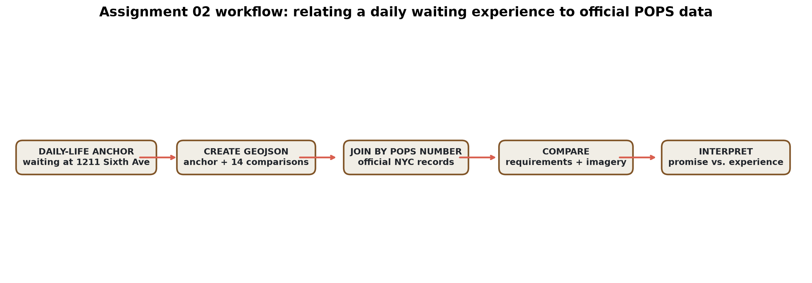

# Assignment 02 — Geoprocessing a daily POPS waiting experience

## Narrative

I frequently visit a friend at **1211 Sixth Avenue** and sometimes need to wait outside before my friend gets in. That recurring experience makes the support for waiting—especially a place to sit or find protection from weather—personally meaningful rather than abstract.

The submitted dataset treats 1211 Sixth Avenue as my **daily-life anchor** and relates it to fourteen other outdoor POPS along the same corridor that I encountered through course research, NYC Open Data, Google Street View, and the final web map. The attributes distinguish the physically experienced anchor from the remote comparison sites. This prevents digital research from being misrepresented as field observation.

The official record for 1211 Sixth Avenue includes public access but does not document seating as a required amenity. That does not prove seating is physically absent today; it shows why the difference between legal obligation and lived waiting experience is worth investigating.

## Submitted GeoJSON

- [`02_pops_research_mental_map.geojson`](02_pops_research_mental_map.geojson)
- Geometry type: Point
- Feature count: 15—one confirmed daily-life anchor and fourteen research comparisons
- Coordinate reference system: WGS 84 longitude/latitude (GeoJSON default)

## Proposed related dataset

**NYC Department of City Planning — Privately Owned Public Spaces (POPS)**  
NYC Open Data API: https://data.cityofnewyork.us/resource/rvih-nhyn  
Dataset identifier: `rvih-nhyn`

The official dataset supplies legal and administrative attributes—including required area, access hours, public-space type, and required amenities—that are not contained in my subjective research map.

## Proposed geoprocessing methodology

1. Validate the mental-map points as WGS 84 GeoJSON and check coordinates.
2. Select the `daily_life_anchor` at 1211 Sixth Avenue and join it to the official POPS table using `pops_number`.
3. Join the fourteen corridor comparison points by the same identifier.
4. Use a nearest spatial join as a diagnostic only; a distance greater than 25 meters would flag a coordinate mismatch.
5. Parse the official amenity text into comparable boolean fields such as seating, tables, landscape, lighting, signage, litter receptacles, and water.
6. Compare the personal activity of waiting with the breadth of documented requirements, without treating an undocumented amenity as physically absent.
7. Map how the official promise changes along the corridor while keeping the physical anchor distinct from remotely researched sites.

## Methodological reflection

This workflow relates a lived waiting experience to an institutional dataset without collapsing them into the same kind of evidence. The personal layer explains why seating and support for staying matter at 1211 Sixth Avenue. The official layer records legal obligations across the corridor. My experience does not establish current compliance, and the database does not describe comfort. A structured observation at 1211 could become a third layer rather than being inferred from either one.
