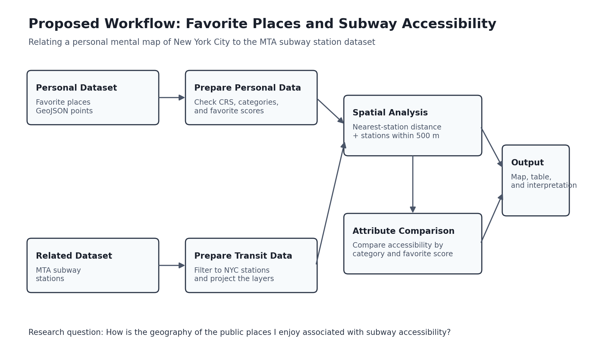

# Places I Enjoy in New York City

## Narrative

This project presents a personal mental map of public places that shape my experience of New York City. The dataset includes parks, neighborhoods, museums, architectural landmarks, and other urban destinations that I enjoy visiting. Together, these locations describe the parts of the city that I associate with walking, viewing, photography, shopping, dining, and cultural experiences.

## Personal Dataset

**File:** [`places_i_enjoy_nyc.geojson`](places_i_enjoy_nyc.geojson)

The GeoJSON is a point dataset containing 12 places in New York City. Coordinates use longitude and latitude in WGS 84 (`EPSG:4326`).

Each point contains the following attributes:

| Field | Description |
|---|---|
| `place_id` | Unique identifier for each location |
| `name` | Name of the place |
| `category` | Type of place, such as Park, Neighborhood, Museum, Bridge, or Architectural Landmark |
| `favorite_score` | Personal preference score from 1 to 5 |
| `activity` | Activities associated with the place, such as walking, viewing, photography, shopping, or dining |

The current dataset contains places such as SoHo, West Village, Little Island, Central Park, the Oculus, MoMA, and the Metropolitan Museum of Art. The concentration of points in Manhattan is itself part of the narrative, because it reflects the areas of New York that I have experienced most directly so far.

## Proposed Related Dataset

**MTA Subway Stations**  
[New York State Open Data — MTA Subway Stations](https://data.ny.gov/Transportation/MTA-Subway-Stations/39hk-dx4f)

This dataset provides station locations and related attributes for New York City Subway and Staten Island Railway stations. It can be related to my point dataset to examine the accessibility of the places that form my positive mental image of the city.

## Research Question

**How is the geography of the public places I enjoy associated with subway accessibility?**

This question does not assume that subway access causes me to like a place. Instead, it tests whether the locations in my dataset tend to be close to subway stations and whether accessibility differs across place categories or favorite scores.

## Proposed Methodology

1. Import `places_i_enjoy_nyc.geojson` and the MTA Subway Stations dataset into QGIS.
2. Confirm that both layers use compatible coordinate reference systems.
3. Reproject both layers into a projected CRS suitable for measuring distance in New York City, such as `EPSG:2263`.
4. Use **Distance to Nearest Hub** or **Join Attributes by Nearest** to calculate the distance from each favorite place to its nearest subway station.
5. Create a 500-meter buffer around each favorite place.
6. Use **Join Attributes by Location (Summary)** to count the number of subway stations within each buffer.
7. Add the nearest-station distance and nearby-station count to the personal dataset.
8. Compare accessibility measures by `category`, `favorite_score`, and `activity`.
9. Produce a map using graduated symbols or labels to show which favorite places are more or less accessible by subway.
10. Interpret the pattern while acknowledging that the sample is personal, small, and geographically concentrated.

## Proposed Outputs

- A map of favorite places and subway stations
- A 500-meter accessibility buffer around each place
- A table containing distance to the nearest station and number of nearby stations
- A comparison of accessibility by place category and favorite score
- A short interpretation of how transit access relates to my mental image of New York City

## Workflow Diagram

