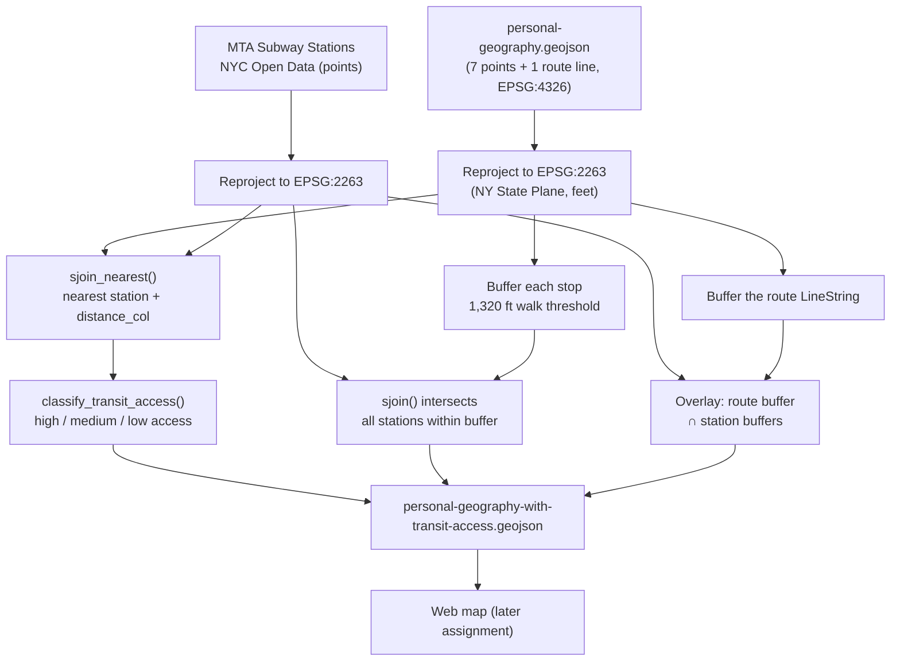

# Geoprocessing Assignment — A Daily Geography of Morningside Heights

## The dataset

`personal-geography.geojson` is a small narrative dataset describing one
version of an ordinary day as a GSAPP student living in Morningside
Heights: the apartment, the coffee cart, the studio, the pastry shop
where crits get debriefed, a bench in Riverside Park, and the subway
entrance used for everything outside the neighborhood.

It mixes two geometry types in a single `FeatureCollection`:

- **7 Point features** — the anchor locations of the day, each with a
  `category` (`home`, `coffee`, `food`, `study`, `recreation`, `subway`),
  a short narrative `description`, `frequency_per_week`, `typical_time`,
  and `mood`.
- **1 LineString feature** — the daily walking route from the apartment
  to the studio (`category: route`), with `distance_miles`,
  `avg_duration_min`, and `frequency_per_week`.

`build_dataset.py` reconstructs this same GeoDataFrame programmatically
with `geopandas`, following the same conventions as the course tutorial
(explicit CRS, a `FeatureCollection` written with `to_file(..., driver="GeoJSON")`).

## Proposed related dataset

**MTA Subway Stations** (point layer), available via NYC Open Data:
<https://data.cityofnewyork.us/Transportation/Subway-Stations/arq3-7z49>
(also mirrored by the MTA itself at <https://data.ny.gov/Transportation/MTA-Subway-Stations/39hk-dx4f>).

This is a dataset I have direct access to — it's a public GeoJSON/Shapefile
export, no API key required, and it is small enough to load in full rather
than needing an attribute filter the way the PLUTO tax lot data did in the
tutorial.

I'm choosing this dataset because the assignment prompt specifically calls
out subway routes as a natural counterpart to a personal mental map, and
because my dataset already contains one subway entrance as a point of
reference — relating it to the *full* citywide station layer lets me ask
a more general question: **how transit-accessible is my everyday
geography, beyond the one station I already know I use?**

## Proposed methodology

The workflow below follows the same sequence of operations used in the
course tutorial to relate tax lots and building footprints — reproject,
filter/mask, join, and derive a new attribute with a function — applied
instead to points and a transit network.

1. **Reproject both datasets** from `EPSG:4326` to `EPSG:2263` (NY State
   Plane, feet), so that distance calculations are in a meaningful planar
   unit rather than degrees.
2. **Spatial join, nearest-neighbor**: use `sjoin_nearest()` to match each
   of my personal stops to its closest subway station, recording the
   distance with `distance_col="dist_to_subway_ft"` — the same function
   used in the tutorial to compare building footprints against tax lots.
3. **Buffer + intersect**: buffer each stop by a walkability threshold
   (1,320 ft, ≈ a 5-minute walk) and intersect against the subway
   stations layer to list *every* station within an easy walk, not just
   the nearest one — useful for stops like the studio or the apartment,
   which may have more than one nearby option.
4. **Derive a new attribute**: write a small classifier function
   (`classify_transit_access()`, modeled on the tutorial's `is_soft_site()`)
   that turns the continuous `dist_to_subway_ft` measurement into a
   categorical `transit_access` label (`high_access`, `medium_access`,
   `low_access`).
5. **Buffer the commute route itself**: buffer the `LineString` route and
   overlay it against the subway stations' buffers to see whether the
   walk to studio doubles as transit-accessible corridor, which would be
   relevant if I ever needed an alternate way to get to campus.
6. **Export** the enriched dataset back to GeoJSON for use in a future web
   map (tying into the Web Mapping assignment later in the course).

If I did *not* already have access to this dataset, the fallback would be
to construct it manually in `geojson.io` by tracing station locations from
the MTA's published system map, tagging each with a `line` attribute — a
much slower version of the same point dataset.

## Workflow diagram

## Files in this submission

| File | Description |
|---|---|
| `personal-geography.geojson` | The narrative dataset (7 points + 1 line) |
| `build_dataset.py` | Script that builds the dataset with `geopandas` and sketches the join workflow against MTA Subway Stations |
| `README.md` | This document |
