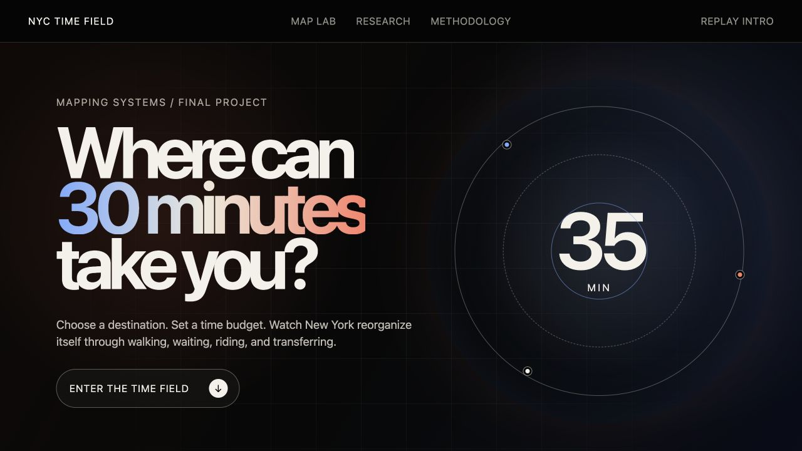

# Final Project — NYC TIME FIELD

**Student:** Ci Song

**Live project:** [NYC TIME FIELD on this repository's GitHub Pages](https://cisanotheraccount.github.io/cdp-mapping-systems_Ci/)

**Complete source:** [student-projects/Final_Ci_Song_NYC_Time_Field](https://github.com/Cisanotheraccount/cdp-mapping-systems_Ci/tree/ci/nyc-time-field/student-projects/Final_Ci_Song_NYC_Time_Field)

## Project question

Where can a New Yorker live within a chosen commute-time budget, and how does
that accessible residential field change by travel mode, subway schedule, and
estimated gross rent?

NYC TIME FIELD develops the course's network-analysis and web-mapping methods
into an interactive accessibility model. A reader can place a destination,
choose a 15–90 minute budget, and compare scheduled subway, free-flow driving,
and walking estimates across New York City. The map's H3 cells encode either
time remaining or a housing-unit-weighted 2020–2024 ACS gross-rent estimate.

## Interaction and analysis

- Drag or place a destination and preserve the exact state in a shareable URL.
- Compare weekday AM, weekday midday, and weekend subway schedules.
- Switch independently between travel mode and the 3D height variable.
- Rank NTAs by the share of residential units inside the selected time budget.
- Inspect residential cells and reconstructed subway route steps on the map.
- Download the 5,543-row rent-by-cell table used by the visualization.

## Data and method

The offline Python pipeline combines MTA Static GTFS, MTA station entrances,
OpenStreetMap walking and driving networks, NYC Planning 2020 NTAs, MapPLUTO
residential units, H3 resolution 9, and 2020–2024 ACS rent estimates. A web
worker runs the precomputed network model in the browser, while MapLibre renders
the interactive 3D field. The repository includes the full source, processed
browser assets, reproducible notebook, project diagram, data dictionary,
limitations, final reflection, and automated tests.

This is an accessibility study rather than a live journey planner or rental
listing service. It does not represent delays, traffic, parking, service
outages, or asking rent.

## Verification

- Data contract and geospatial validation: passed.
- Production build and model/render tests: 8/8 passed.
- Desktop and mobile Playwright tests: 10/10 passed.
- TypeScript, ESLint, and serious/critical accessibility checks: passed.
