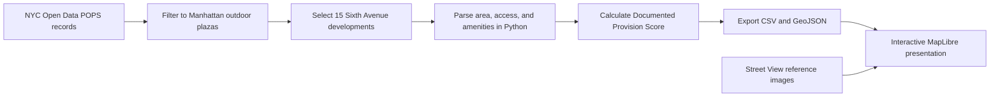

# Public by Requirement

An interactive investigation of legally documented public benefits in fifteen
outdoor privately owned public spaces (POPS) along Sixth Avenue in Midtown
Manhattan.

## Public website

https://krishna-397.github.io/Krishna-s-MAPPING-SYSTEMS-COPY/

## Goal and research question

POPS are produced and maintained by private property owners in exchange for
zoning benefits. This project asks:

> If these plazas share a legal obligation to provide public access, how
> consistent is the breadth of amenities they are required to provide?

The study focuses on developments along Sixth Avenue between approximately West
42nd and West 57th Streets that contain an outdoor plaza component. Restricting
the comparison to one corridor makes unequal requirements easier to see.

## Project workflow



## Method

1. Download the NYC Department of City Planning POPS dataset through the NYC
   Open Data API (`rvih-nhyn`).
2. Filter to Manhattan developments on Sixth Avenue containing an outdoor
   plaza; exclude covered, enclosed, and interior-only public-space types.
3. Parse documented plaza area, access hours, and amenity descriptions with
   Python.
4. Calculate a Documented Provision Score from seven equally weighted amenity
   groups: seating, tables, landscape, lighting, public signage, litter
   receptacles, and water.
5. Classify scores as Limited (0–42), Moderate (43–70), or Extensive (71–100).
6. Export the fifteen study records, 351 other Manhattan POPS locations, and an
   analytical Sixth Avenue boundary as GeoJSON.
7. Visualize the results in a full-viewport, slide-based MapLibre website.

## Key findings

- All 15 developments include a 24-hour public-access requirement.
- 3 of 15 list no required amenities in the official record.
- 11 of 15 require seating.
- The fifteen developments contain approximately 240,489 documented square
  feet of plaza space.
- Comparable access requirements can coexist with very different documented
  amenity programs.

## Important limitation

The project measures documented legal requirements, not present-day physical
condition, maintenance, popularity, comfort, accessibility, or lived
experience. An amenity that is not documented as required is not necessarily
physically absent. The reference images add visual context but do not constitute
a systematic field audit.

## Reflection and future development

This project extends the course exercises by combining data loading,
geoprocessing, network thinking, API-based data acquisition, and interactive web
mapping into one argument. A future semester could add structured field
observations, accessibility measures, current-condition audits, pedestrian
counts, and comparison corridors. That would shift the analysis from what is
legally promised toward what people can presently use.

## Repository structure

- `data/raw/` — dated NYC Open Data snapshot.
- `data/processed/` — cleaned CSV, GeoJSON, study boundary, and summary.
- `data/manual/` — image-source checklist for the fifteen plazas.
- `scripts/build_project.py` — reproducible data-cleaning and scoring workflow.
- `scripts/process_images.cjs` — image-processing helper.
- `web/` — complete presentation website, MapLibre logic, data, and images.

## Rebuild and preview

From the project folder:

```powershell
python scripts/build_project.py
python -m http.server 8000 --directory web
```

Then open `http://localhost:8000`.

The processed dataset is also embedded through `web/data/pops-data.js`, so the
presentation can be opened directly from `web/index.html`. Internet access is
still required for MapLibre and the basemap.

## Presentation controls

The eight sections fill the browser viewport without a fixed 1920×1080 stage.

- Click the right side of a non-interactive slide to advance.
- Click the left side to go back.
- Use the arrow keys, Page Up/Page Down, Home, or End.
- Map points, filters, plaza records, and case-study controls remain interactive.

## Images

All fifteen plaza reference images are included in `web/images/` and keyed by
NYC POPS number. Their checklist is stored at
`data/manual/streetview_image_checklist.csv`.

## Source

NYC Department of City Planning, Privately Owned Public Spaces (POPS), NYC Open
Data dataset `rvih-nhyn`, downloaded August 6, 2026.

https://data.cityofnewyork.us/resource/rvih-nhyn
