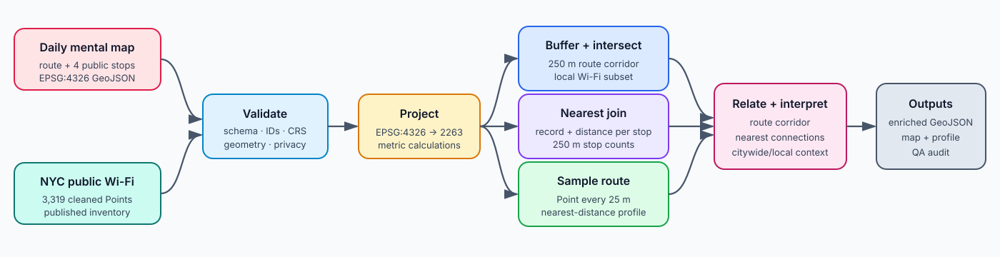
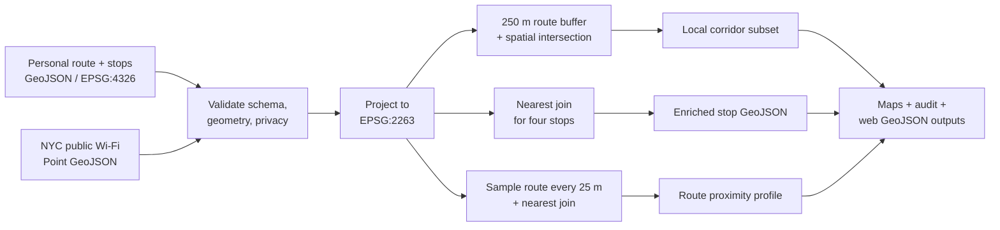

# 02 · Geoprocessing: a daily study route and public Wi-Fi context

## Daily-life narrative

[`daily_study_loop.geojson`](daily_study_loop.geojson) is a privacy-preserving mental map of a generalized weekday routine around Columbia University. One LineString connects four named public places: the 116 St subway entrance, Fayerweather Hall, Butler Library, and the west edge of Morningside Park. Together they describe repeated movement between transit, studio/class, study, and an outdoor break.

The dataset is illustrative rather than an exported GPS trace. It contains no home address, private destination, timestamp history, or claim that the coordinates reproduce an exact daily path.

## Submission requirements

This assignment is stored inside the course repository's `content/Assignments/` folder and includes every item requested in the brief.

| Brief requirement | Submitted item | Status |
|---|---|---|
| A dataset expressing a daily-life narrative | [`daily_study_loop.geojson`](daily_study_loop.geojson) | Included |
| GeoJSON format | One LineString route and four Point stops in `EPSG:4326` | Validated |
| A proposed related dataset | [NYC Wi-Fi Hotspot Locations (`yjub-udmw`)](https://data.cityofnewyork.us/d/yjub-udmw) | Linked |
| A Markdown document containing the related-dataset link | This `README.md` | Included |
| A proposed methodology for relating the datasets | “Proposed workflow” below | Included |
| A workflow expressed as a diagram | [`workflow.svg`](workflow.svg) | Included |

The executed notebook, processing script, maps, tables, and enriched GeoJSON files are supporting evidence beyond the minimum submission.

## Personal GeoJSON schema

| Field | Meaning |
|---|---|
| `feature_id` | Stable unique identifier |
| `name` | Public-place or generalized-route name |
| `feature_type` | `route` or `stop` |
| `sequence` | Narrative order along the routine |
| `activity` | Role of a named stop in the routine |
| `narrative` | Short explanation of why the feature matters |
| `privacy_level` | Precision/privacy description |

The mixed geometry is deliberate: the LineString represents movement, while the Points support stop-by-stop nearest-neighbor analysis.

## Proposed related dataset

The proposed related dataset is NYC Open Data's [NYC Wi-Fi Hotspot Locations (`yjub-udmw`)](https://data.cityofnewyork.us/d/yjub-udmw). It is a citywide Point inventory with attributes including provider, published access type, and location context. A cleaned local copy used by the reproducible analysis is included at `related_data/nyc_wifi_hotspots_clean.geojson`.

The spatial question is:

> Where does this generalized daily routine pass near a recorded public Wi-Fi location, and where along the route is the nearest listed hotspot farther away?

The relationship is contextual, not causal. The route does not explain why Wi-Fi was installed, and a nearby inventory record does not prove that a usable signal reaches the route.

## Proposed workflow

1. Validate the narrative GeoJSON schema, IDs, geometry types, CRS, and privacy fields.
2. Load and validate the related 3,319-point NYC Wi-Fi GeoJSON.
3. Reproject the route, stops, and Wi-Fi points from `EPSG:4326` to New York Long Island State Plane `EPSG:2263`.
4. Buffer the route by 250 metres (approximately 820 feet).
5. Spatially join Wi-Fi points that intersect the route buffer.
6. Nearest-join each named stop to a Wi-Fi record and calculate straight-line distance.
7. Buffer each stop by 250 metres and count intersecting Wi-Fi records.
8. Sample the route every 25 metres and nearest-join every sample to create a continuous proximity profile.
9. Export the enriched stops, route buffer, intersecting Wi-Fi points, connection lines, and route samples as web-compatible `EPSG:4326` GeoJSON.
10. Compare the route-corridor subset with the citywide inventory and interpret the limits of proximity as a measure.





The 250 m distance is an explicit comparison threshold, not an assumed Wi-Fi range. `sjoin_nearest` measures projected Euclidean distance; it is not a pedestrian-network route.

## Implemented evidence

The proposed workflow is implemented in [`analyze_route.py`](analyze_route.py) and documented in the executed [`02_route_wifi_geoprocessing.ipynb`](02_route_wifi_geoprocessing.ipynb). The workflow reports:

- one generalized route and four public-place stops;
- 3,319 related Wi-Fi records;
- 15 records intersecting the 250 m route corridor;
- a nearest recorded hotspot and distance for every stop;
- 49 route samples at 25 m intervals; and
- zero missing nearest joins.

## File inventory

Required submission files:

- `daily_study_loop.geojson` — personal daily-life narrative dataset.
- `README.md` — related-dataset link and proposed methodology.
- `workflow.svg` — proposed workflow diagram.

Supporting and reproducibility files:

- `related_data/nyc_wifi_hotspots_clean.geojson` — local copy of the proposed related dataset.
- `02_route_wifi_geoprocessing.ipynb` — executed, GitHub-readable analysis.
- `build_notebook.py` — reproducibly constructs the notebook.
- `execute_notebook_inprocess.py` — executes notebook cells without requiring Jupyter network ports.
- `analyze_route.py` — reusable geoprocessing pipeline.
- `outputs/route_250m_buffer.geojson` — route buffer exported in WGS84.
- `outputs/route_wifi_context.geojson` — Wi-Fi points intersecting the route corridor.
- `outputs/daily_stops_wifi_enriched.geojson` — named stops with nearest-record and nearby-count attributes.
- `outputs/nearest_wifi_connections.geojson` — straight-line stop-to-nearest-record connections.
- `outputs/route_proximity_samples.geojson` — 25 m samples and nearest-record distances.
- `outputs/nearest_wifi_by_stop.csv` — readable stop-level result table.
- `outputs/geoprocessing_audit.json` — machine-readable validation summary.
- `outputs/01_route_wifi_geoprocessing_map.png` — buffer, route, nearby records, stops, and nearest connections.
- `outputs/02_route_proximity_profile.png` — route-distance profile and citywide/local comparison.

## What the relationship can and cannot tell us

**It can:** identify records intersecting a defined geometric corridor; calculate projected straight-line distances; compare named stops; and show where the published inventory is more or less proximate to this generalized route.

**It cannot:** establish signal radius, speed, uptime, login requirements, indoor access, opening hours, walking distance, safety, demand, or actual use. Multiple inventory records may share coordinates. The personal dataset is small and authored, so it represents one mental map rather than a general student experience.

## Reproduce

From this folder:

```bash
python analyze_route.py
python build_notebook.py
python execute_notebook_inprocess.py
```
