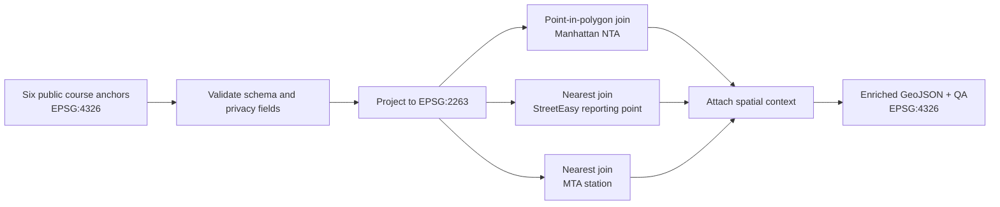

# Assignment 02 — Geoprocessing

## View the code and saved results on GitHub

**[Open the executed Jupyter Notebook](02_geoprocessing.ipynb)**

The Notebook presents the narrative, actual GeoPandas operations, tables,
validation checks, workflow, and mapped result together. It is the GitHub-native
reader copy; the standalone Python pipeline remains the authoritative reusable
script.

Both Notebook visuals are constructed by executable GeoPandas/Matplotlib code;
no saved image is loaded into an output cell. The required workflow is also
expressed below as GitHub-rendered Mermaid source rather than an image file.



## Question and method

What does each public Manhattan course anchor inherit from its surrounding rent
geography and nearest transit infrastructure?

Six real public anchors from the author's course artifacts form a privacy-safe
coursework mental map. The workflow:

1. validates six Point features and excludes precise-address fields;
2. projects all metric operations to **EPSG:2263**;
3. uses a point-in-polygon spatial join to assign each place to an NTA;
4. uses deterministic nearest joins for a StreetEasy reporting-area point and
   an MTA subway station point; and
5. exports one enriched row per input feature in **EPSG:4326**.

```python
with_nta = gpd.sjoin(
    places_projected,
    nta[["name", "nta2020", "geometry"]].rename(columns={"name": "nta_name"}),
    how="left",
    predicate="within",
)

enriched = gpd.sjoin_nearest(
    with_rent,
    station_fields,
    how="left",
    distance_col="subway_distance_ft",
)
```

The executed result preserves **6/6** places, has zero missing NTA, rent-area,
or subway joins, and records nearest-station distances from **45.4 m to 316.1
m**.

## Source and result files

- [Full reusable spatial pipeline](scripts/process_personal_places.py)
- [Formal six-place GeoJSON](inputs/personal_places.geojson)
- [GitHub-mappable enriched GeoJSON](outputs/personal_places_enriched.geojson)
- [Complete methodology and limitations](METHOD.md)
- [Machine-readable audit](outputs/geoprocessing_audit.json)

## Reproduce

```bash
python scripts/process_personal_places.py
python build_notebook.py
```

These anchors are intentionally limited to public-site or intersection
precision. The narrative does not claim a residence, private routine, or an
unverified physical visit. A nearest representative rent point does not mean
its borough or neighborhood value applies exactly at the anchor, and a nearest
station point is not yet a pedestrian-network route; Assignment 04 addresses
that distinction.
