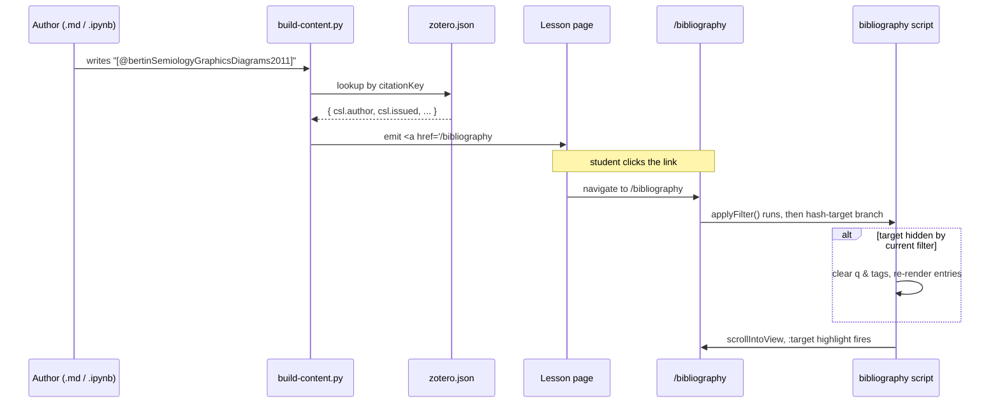

# feat: Citation anchors from markdown to /bibliography

## Summary

A pandoc-style citation rewriter that converts `[@citationKey]` tokens in lesson markdown into anchor links pointing at the matching entry on `/bibliography`. Bibliography entries get per-entry HTML ids and a `:target` highlight; clicking a citation lands the reader on the matching entry, clears the page's tag/search filter only when it would have hidden the target, and briefly highlights the entry.

Two surfaces of work:

1. **Bibliography page** — per-entry `id="bib-<citationKey>"`, target CSS, filter-aware scroll-into-view on hash arrival.
2. **`scripts/build-content.py`** — small regex-based citation rewriter applied to all rendered markdown (both `.md` files and notebook markdown cells).

---

## Problem Frame

The syllabus and (eventually) lesson notebooks reference course readings inline. Today the references are full reading-list entries written by hand; there is no link between any inline reference and the corresponding `/bibliography` entry. Authors who want to cite a reading have to type the full reference, hand-write a `/bibliography#...` URL, or skip the link entirely. The bibliography page already renders all entries from Zotero in Chicago Author-Date format and supports client-side filtering — but each entry has no stable HTML id, so direct linking from anywhere on the site isn't possible.

This plan introduces a compact pandoc-style citation syntax that authors can type, and the build pipeline rewrites the syntax into anchor links to the matching `/bibliography` entry.

---

## Requirements

- **R1** — Authors write `[@citationKey]` in any lesson markdown (`.md` file or notebook markdown cell) and the rendered lesson contains a clickable anchor link to the matching `/bibliography` entry.
- **R2** — Visible link text uses Author-Year style (e.g., `(Smith 2026)`), derived from the entry's CSL metadata.
- **R3** — Bibliography entries have stable HTML ids of the form `bib-<citationKey>` so `/bibliography#bib-<key>` lands on the right entry.
- **R4** — When the URL hash points to a bibliography entry the current filter (tags + search input) would hide, the filter clears so the entry becomes visible.
- **R5** — The target entry gets a brief visual highlight (CSS `:target`) so a reader landing from a click immediately sees where they are.
- **R6** — An unknown citation key (no match in `zotero.json`) produces a build-time warning and renders as visibly-broken fallback text (`[?@unknown_key]`) so authors notice typos.
- **R7** — Existing reading-list prose entries in the syllabus are **not** touched — the new syntax is additive only.
- **R8** — The same rewriter handles `.md` files and notebook markdown cells so any future lesson can use citations.

---

## Key Technical Decisions

- **D1 — Citation syntax**: pandoc-style `[@citationKey]`. Single-cite only in this plan; multi-cite (`[@a; @b]`) deferred. Rationale: academic-familiar, portable to other tools (pandoc, quarto), tight regex grammar that doesn't collide with normal markdown brackets.
- **D2 — Canonical key**: BibTeX `citationKey` from Zotero's `data.citationKey` field. Already available via the existing `include=data` fetch flag — needs surfacing in the normalized entry and the bibliography schema only. Rationale: human-readable (`bertinSemiologyGraphicsDiagrams2011`) versus Zotero's opaque key (`9GIUHJ6Q`). Authors will type these.
- **D3 — Anchor format**: `id="bib-<citationKey>"`. The `bib-` prefix namespaces ids to avoid colliding with arbitrary HTML ids elsewhere on the page. Rationale: clear convention, low collision risk, greppable.
- **D4 — Link text rendering**: Surname + year extracted from `csl.author[0].family` and `csl.issued.date-parts[0][0]`. Falls back to the citation key itself if either field is missing. Rationale: matches the Chicago Author-Date house style already used on the bibliography page.
- **D5 — Missing-key behavior**: print a build-time warning via the existing `print(f"  ⚠️  ...")` convention naming the lesson slug and the unknown key; render as `[?@unknown_key]` in the page (visibly broken). Rationale: silent failure leaves dead citations; hard build failure blocks legitimate work in progress.
- **D6 — Filter-clear behavior on target landing**: the bibliography's existing client-side script reads `location.hash` on page-load (and on `astro:page-load` for ClientRouter view transitions). If the target `<li>` is `.hidden` under the current filter state, clear the URL hash filter (`q`, `tags`), re-apply, and `scrollIntoView` so `:target` fires. Rationale: minimally invasive — if a filter would not have hidden the target, the page does nothing special.

---

## High-Level Technical Design



Directional guidance for review, not implementation specification.

---

## Implementation Units

### U1. Surface `citationKey` in bibliography data

**Goal**: make BibTeX citation keys available as a first-class field on each bibliography entry so the rewriter can look them up by key.

**Requirements**: R3, R8.

**Dependencies**: none.

**Files**:
- `scripts/fetch-zotero.ts` — add `citationKey` to the `BibliographyEntry` interface and the `normalize()` mapping (read from `item.data?.citationKey`).
- `src/content.config.ts` — add an optional `citationKey` string field to the bibliography collection schema.
- `src/data/zotero.json` — re-fetched as part of the refresh workflow, not edited by hand.

**Approach**: The existing fetch already requests `include=csljson,bib,bibtex,data`, so `data.citationKey` is already in the API response. Surface it during normalization. Make the schema field optional so legacy items without a key set in Zotero still validate.

**Patterns to follow**: same shape as the existing `tags` and `subcollections` fields — pulled from the API response, attached to the normalized entry, declared in the schema.

**Test scenarios**:
- An entry whose Zotero record has a `citationKey` set has the value surfaced on the normalized entry.
- An entry whose Zotero record has no `citationKey` (rare but possible) produces a normalized entry with the field omitted; no crash.
- Re-running `npm run build:zotero` produces a `zotero.json` whose entries include the field for every Zotero item that has one.
- If two entries share the same `citationKey` (Zotero permits this), the build prints a warning naming the colliding entries so the author can deduplicate.

**Verification**: `python3 -c "import json; print(sum(1 for e in json.load(open('src/data/zotero.json'))['entries'] if e.get('citationKey')))"` reports a non-zero count.

---

### U2. Anchor ids + target CSS on bibliography page

**Goal**: every rendered bibliography entry has a stable `id`; landing via `:target` produces a brief highlight and doesn't clip behind the sticky header.

**Requirements**: R3, R5.

**Dependencies**: U1.

**Files**:
- `src/pages/bibliography.astro` — the `<li data-entry ...>` element gets `id={`bib-${entry.data.citationKey ?? entry.data.key}`}` and a scroll-margin class that clears both the sticky page header and the sticky section-jump bar.
- `src/pages/bibliography.astro` (style block) — add a `:target` rule (subtle `bg-accent-soft` flash that fades over ~1.5s).

**Approach**: Falls back to Zotero's opaque `key` when `citationKey` is absent so every entry is still link-targetable (no blank ids). Scroll-margin value follows the existing `scroll-mt-40` convention already used for section headings on the same page, which accounts for both sticky bars.

**Patterns to follow**: existing `scroll-mt-40` on section elements in `src/pages/bibliography.astro`; existing `aria-current` and chip styling for related visual treatments.

**Test scenarios**:
- Inspecting the rendered DOM shows `<li id="bib-bertinSemiologyGraphicsDiagrams2011" ...>` (or similar) on every entry.
- Visiting `/bibliography#bib-<known-key>` directly scrolls the entry into view with the citation visible below the sticky nav (not clipped).
- The `:target` highlight is briefly visible on landing and fades cleanly.
- Entries without a `citationKey` fall back to `id="bib-<zoteroKey>"` (e.g., `id="bib-LXJCF8AB"`); no blank or duplicate ids appear.

**Verification**: `grep -c 'id="bib-' dist/client/bibliography/index.html` equals the entry count in `zotero.json`.

---

### U3. Filter-aware scroll-into-view on target hash

**Goal**: arriving at `/bibliography#bib-<key>` makes the target entry visible even when the current filter (tag chips + search input) would have hidden it.

**Requirements**: R4.

**Dependencies**: U2.

**Files**:
- `src/pages/bibliography.astro` (script block) — extend the existing `applyFilter()` / `attach()` logic with a target-visibility check.

**Approach**: After `applyFilter()` runs, read `location.hash` for a `#bib-` prefix. If the matching `<li data-entry>` is `.hidden`, clear filter state (write empty hash via the existing `writeHash` helper), re-run `applyFilter()` so the entry becomes visible, then `scrollIntoView({ block: 'center' })`. Don't interfere when the target is already visible — the browser's native anchor scroll handles that. Listen on `hashchange` for in-page link clicks.

**Patterns to follow**: existing `attach()` function in `src/pages/bibliography.astro`, the existing hash state model (`q=...&tags=...`), the existing `astro:page-load` listener that re-attaches on ClientRouter view transitions.

**Test scenarios**:
- Visiting `/bibliography#bib-<key>` cold (no prior filter state) scrolls to the entry; no flash of hidden-then-visible.
- Visiting `/bibliography#bib-<key>` when the URL also has `q=somethingThatHidesIt` — the filter clears, the entry becomes visible, then scrolls into view.
- Clicking a citation link from `/lessons/syllabus` navigates to `/bibliography#bib-<key>` and produces the same behavior (validates ClientRouter view-transition handling).
- Visiting `/bibliography` with no hash leaves all filter state alone (no regression).
- Hashchange within the bibliography page (in-page anchor click) re-runs the visibility check.

**Verification**: manually exercise the five scenarios in `npm run dev`; spot-check that the script in the built page contains the hash-target branch.

---

### U4. Citation rewriter in `build-content.py`

**Goal**: detect `[@citationKey]` tokens in any markdown body and rewrite each to an `<a>` element linking to `/bibliography#bib-<key>`, with `(Author Year)` as the link text.

**Requirements**: R1, R2, R6.

**Dependencies**: U1.

**Files**:
- `scripts/build-content.py` — new function for the rewriter and a module-level loader that reads `src/data/zotero.json` once at process start, building a `{citationKey: {author, year, zoteroKey}}` lookup map.

**Approach**: A regex matches `[@<key>]` where the key is `[A-Za-z0-9_:.\-]+`. For each match:
- Look up the key in the loaded map.
- **Found**: extract `csl.author[0].family` (surname) and `csl.issued.date-parts[0][0]` (year), build text `(Surname Year)`, and emit `<a href="/bibliography#bib-<key>">(Surname Year)</a>`.
- **Missing**: emit `[?@unknown_key]` verbatim (visibly broken, not a link) AND print a build-time warning via the existing `print(f"  ⚠️  ...")` convention, naming the lesson slug and the unknown key.

Edge cases the regex / replacer handles explicitly:
- A `[@key]` inside a fenced code block (`` ``` ``) is **not** rewritten — authors quoting the syntax in docs.
- `[@key]` adjacent to punctuation (`. [@key],` or `(see [@key])`) preserves the surrounding characters.
- An entry whose `csl.author` is empty (organizational author, corporate body) falls back gracefully to `(<citationKey>)` as link text so the link is still useful.

Multi-cite syntax (`[@a; @b]`) is deferred — see Scope Boundaries.

**Patterns to follow**: existing rewriters in `scripts/build-content.py` — `rewrite_relative_images`, `strip_leading_title`, `sanitize_html_output`. Same `re.compile` + `re.sub` callback shape.

**Test scenarios**:
- A markdown body containing `[@bertinSemiologyGraphicsDiagrams2011]` (a known key) is rewritten to `<a href="/bibliography#bib-bertinSemiologyGraphicsDiagrams2011">(Bertin 2011)</a>`.
- A body containing `[@unknown_key]` is rewritten to `[?@unknown_key]` (verbatim placeholder), and a warning is printed naming the lesson and the key.
- A body containing `[@key]` inside a fenced code block (triple-backtick) is **not** rewritten.
- A body containing `[@KEY-1_2.3]` (mixed alphanumeric, hyphen, underscore, dot) is matched correctly.
- Punctuation outside the brackets (`(see [@key])`, `. [@key],`) is preserved.
- A body containing no citations is returned unchanged (no spurious whitespace edits).
- An entry whose `csl.author` is empty produces `(citationKey)` as link text.

**Verification**: small inline smoke test calling the rewriter over a fixture string; manual check by rendering the syllabus and counting `<a href="/bibliography#bib-` occurrences.

---

### U5. Hook the rewriter into both markdown and notebook paths

**Goal**: citations work uniformly across `.md` lessons and notebook markdown cells so any future lesson can use the syntax.

**Requirements**: R1, R8.

**Dependencies**: U4.

**Files**:
- `scripts/build-content.py` — call the new rewriter from `process_markdown_file()` (for `.md` files) and from notebook markdown-cell conversion in `cell_to_markdown()` / `process_notebook()`.

**Approach**: Apply citation rewriting **after** `rewrite_relative_images` (so relative image refs are settled first) and **before** `strip_leading_title` (so the H1 stripping operates on rewritten text). This matches the existing ordering convention for the chain of rewriters. The `state` dict already carries `lesson_slug`; piggyback on it so missing-key warnings can name the lesson.

**Patterns to follow**: existing rewriter chain in `process_markdown_file()` and `process_notebook()`.

**Test scenarios**:
- A `.md` file with `[@key]` in its body renders the same anchor link as a notebook markdown cell with the same syntax.
- Both no-execute and `--execute` builds emit the same rewritten markdown (rewriter does not depend on cell outputs).
- The order of existing rewriters is unchanged for non-citation bodies (no regressions on image rewriting / H1 stripping).

**Verification**: rebuild both `comparing-census-variables.ipynb` (notebook) and `syllabus.md` (md file) with a test citation; both produce the same `<a>` markup.

---

### U6. Document the syntax and add an example to the syllabus

**Goal**: the author and future contributors know how to write citations; the syllabus has at least one example so the end-to-end round-trip is exercised on a real page.

**Requirements**: R1 (end-to-end), R7 (additive only).

**Dependencies**: U4, U5, U2.

**Files**:
- `README.md` — append a small "Inline citations" subsection under "Maintaining course resources" describing the syntax, the canonical key, and the missing-key behavior.
- `content/Syllabus/syllabus.md` — add one or two example citations alongside the existing prose reading-list entries (additive only — existing entries untouched).

**Approach**: Doc shape mirrors the existing "Maintaining course resources" section. Use a known key (e.g., `bertinSemiologyGraphicsDiagrams2011`) so the round-trip is reproducible by anyone reading the docs.

**Test expectation: none -- documentation + content edit only.** Manual smoke: navigate the rendered syllabus and click the example citation, verify it lands on the correct bibliography entry with the highlight.

**Verification**: `grep -c 'Inline citations' README.md` ≥ 1; the rendered `/lessons/syllabus` HTML contains at least one `<a href="/bibliography#bib-`.

---

## Scope Boundaries

**In scope**: the work above (U1–U6).

**Deferred to Follow-Up Work**:
- Multi-cite syntax (`[@key1; @key2]` → `(Smith 2020; Jones 2021)`). Trivial regex extension but not worth bundling before single-cite is stable.
- Per-lesson reference list auto-generated at the bottom of each lesson page from the citations that appeared in that lesson. Real pedagogical value but needs threading cited-key state through cell-by-cell conversion and emitting a new prose block — its own pass.
- Deep-linking to filter state (`/bibliography#tags=Networks,Methods`) from anywhere. Separate UX direction.
- Rewriting the existing inline reading-list entries in the syllabus into the new citation syntax (user-confirmed: not in this plan).

**Outside this product's identity**:
- Generating a full BibTeX file for download from the rendered citations.
- Citation count badges or "cited N times" hover state.
- CSL style switching at runtime on the bibliography page (Chicago ↔ APA toggle).

---

## Risks & Open Questions

- **Risk — `citationKey` collisions in Zotero**: Zotero permits two items to share a `citationKey` by accident. The lookup map silently picks the last write. Mitigation in **U1**: log a warning at fetch time when the same `citationKey` appears more than once in normalized entries, so the author can deduplicate in Zotero.
- **Risk — `citationKey` empty in Zotero**: an entry with no `citationKey` set is invisible to the rewriter. Authors can't cite it until they fill it in. The bibliography page still links to it via the `key` fallback. Acceptable — surface in the README "Inline citations" docs.
- **Risk — `[@text]` collisions with arbitrary author intent**: an author could legitimately write `[@some_handle]` for unrelated reasons. The missing-key warning catches false positives loudly so they get fixed. The regex is conservative (only matches the `[@<key>]` shape, no broader patterns).

**Open Questions**: none blocking this plan.

---

## Sources & Research

- **Local patterns**:
  - `scripts/build-content.py` existing rewriter chain (`strip_leading_title`, `rewrite_relative_images`, `sanitize_html_output`, `maybe_externalize_html`) — the rewriter target follows the same shape.
  - `src/pages/bibliography.astro` filter + view-transition handling — the hash-target branch hooks into the existing `applyFilter()` / `attach()`.
  - `scripts/fetch-zotero.ts` Zotero API include flags — `data` is already in the include list.
- **Zotero API**: verified live against the `847AR7X4` collection — `data.citationKey` is present in responses with `include=data` (sample value: `bertinSemiologyGraphicsDiagrams2011`).
- **No external research consulted** — strong local patterns, well-bounded change, no security or data-migration concerns.
